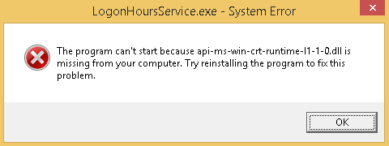

# Classic Parental Control (for Windows)

The project provides utilities which allow you to establish/maintain Parental Control for Local Accounts in Windows 10.
- `LogonHoursService` monitors allowed logon hours (which you typically can set with a command like `net user USERNAME /time:M-F,10-18`) and locks the session once the time is over

## Compilation
You need VS2019 with vc142 toolkit to build the solution.

## Installation

1. Copy all binaries from the archive into a directory with read-only access to Everyone, so only Administrators can remove or update them (if needed).
2. Run `LogonHoursService` from command line (with any permissions) for testing purposes, close its console window after ~5 seconds and examine the log in `%TEMP%\LogonHoursService.log`. The log should start with something like this:
   `2021.11.28 02:31:03,322 [INFO] [2672] wmain: ========================================`
   `2021.11.28 02:31:03,323 [INFO] [2672] wmain: Log initialized successfully`
   `2021.11.28 02:31:03,323 [INFO] [2672] wmain: Version: 1.0.0 Alpha`
   `2021.11.28 02:31:03,323 [INFO] [2672] wmain: Build  : Nov 27 2021 20:16:40`
   `2021.11.28 02:31:03,323 [INFO] [2672] wmain: _MSC_FULL_VER: 19.29.30133`
3. As Administrator install the service by executing `LogonHoursService --install`.
4. Start the service manually.
5. Try setting time restrictions for a local user profile with a command like `net user USERNAME /time:M,12-13`.
6. Check whether the session of `USERNAME` is locked when the specified time is over (take a look into the service log in `C:\Windows\Temp\LogonHoursService.log`)
7. You can enable verbose logging by placing a file with name `LogonHoursService.exe.log4cpp` (into the directory with the executable) with the content like:
   `log4cpp.rootCategory=DEBUG`
8. If everything works as expected, enable autostart for the service.

## Supported Windows versions

This project is intended to be useful in Windows 10, where you cannot easily establish parental control for Local Accounts.

Though the built-in classic parental control is available in Windows 7/8.1, you still can make use of this project.

**(!)** For Windows 7/8.1 you may need to install [KB2999226](https://support.microsoft.com/en-us/help/2999226/update-for-universal-c-runtime-in-windows), if the system complains about missing `api-ms-win-crt-runtime-l1-1-0.dll`:

